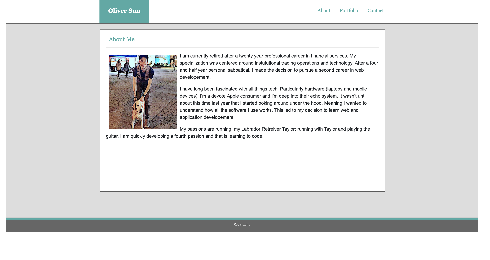
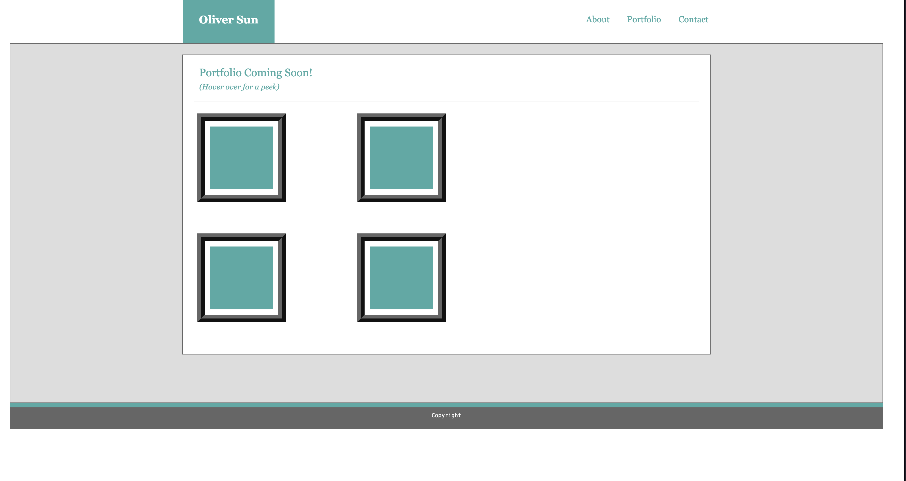
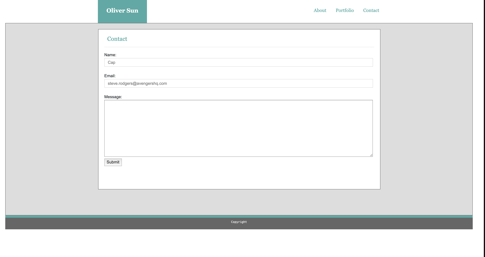
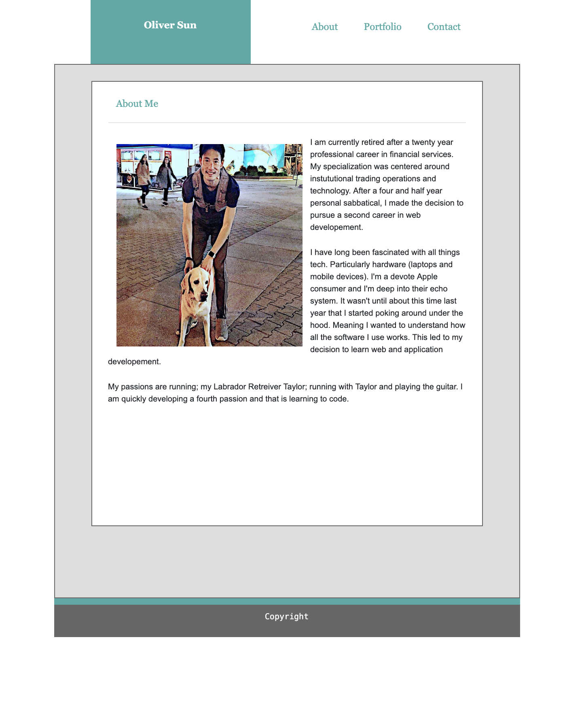
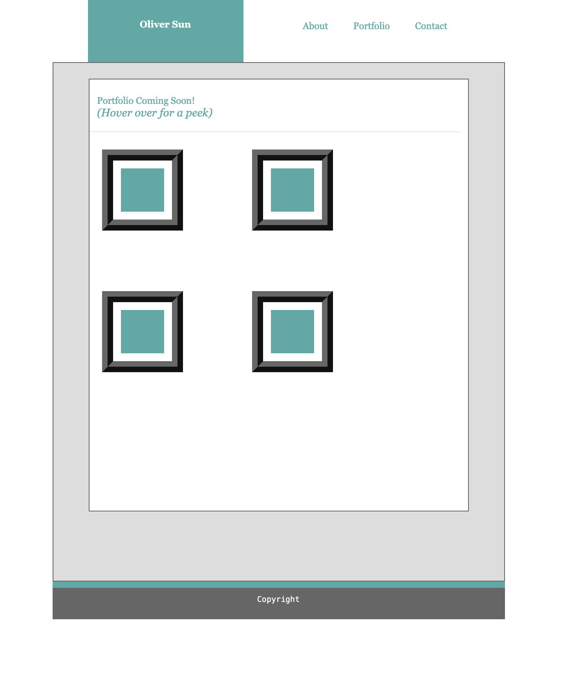
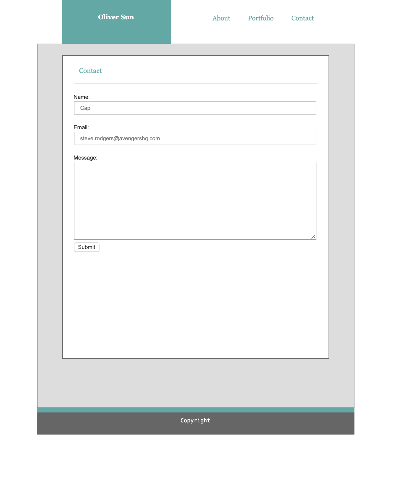
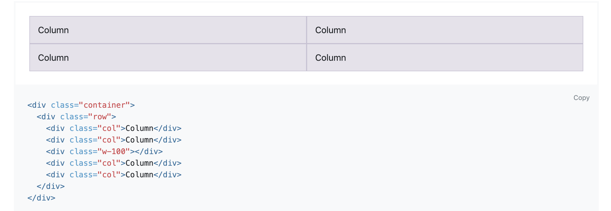

# Bootstrap-Portfolio

## Page previews (Full Size): 

## Page previews (Smaller Sizes): 

## About the project:
  * We had to take our Basic-Portofio project and recreate it using Bootstrap.

## Techologies used to build:
  * HTML
  * CSS
  * Bootstrap

## Methodology:
  I took the Bootstrap starter template and pasted my HTML into the main fluid container for Bootstrap. I used the Bootstrap grid shown below to place my content into. I also added my own css file to format the elements within Bootstrap's grid. I used the NAV from Bootstrap for my Navbar but used my own styling for the inner text.

## Bootstrap Grid used:

